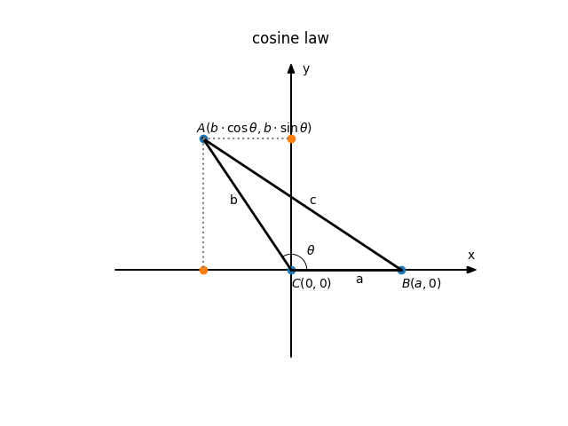
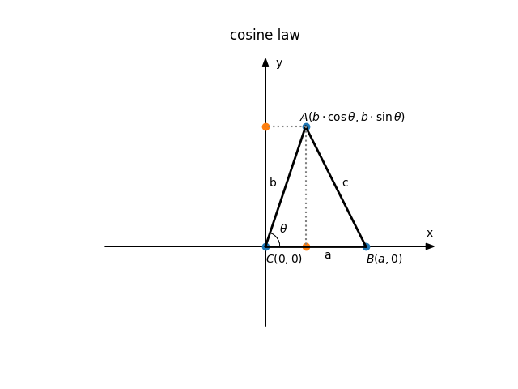

## 余弦定理（cosine law）的证明

**余弦定理** 三角形任何一边的平方等于其他两边平方的和减去这两边与它们夹角的余弦的积的两倍。

具体针对任意三角形：比如三角形$\triangle ABC$中,如果$\angle A$，$\angle B$，$\angle C$的对边分别用a、b、c来表示那么就有如下关系：

$$
\begin{aligned}
a^{2} & = b^{2} + c^{2} - 2bc \cdot \cos A \\
b^{2} & = a^{2} + c^{2} - 2ac \cdot \cos B \\
c^{2} & = a^{2} + b^{2} - 2ab \cdot \cos C
\end{aligned}
$$

**证明** 余弦定理的证明有很多种，我们这里利用解析几何的方式来证明：

首先，我们将三角形$\triangle ABC$放到笛卡尔直角坐标系下，并让$C$点与坐标系的原点对齐，
让$B$点落在直角坐标系的$x$正半轴上，并且为了避免混淆，我们将$\angle C$的大小用$\theta$表示，如下图：

于是我们可知：$|AB|=c$，$|AC|=b$，$|BC|=a$，$\angle C = \theta$，
$C$点坐标为$(0, 0)$，$B$点坐标为$(a, 0)$，$A$点坐标为$(b \cdot \cos \theta, b \cdot \sin \theta)$，
于是根据两点间的距离公式，有：

$$
\begin{aligned}
|AB| & = \sqrt{(x_{a} - x_{b})^{2} + (y_{a} - y_{b})^{2}} \\
     & = \sqrt{(b \cdot \cos \theta - a)^{2} + (b \cdot \sin \theta - 0)^{2}}
\end{aligned}
$$

我们将距离公式两边平方，并把$|AB|=c$代入，到如下结果：

$$
\begin{aligned}
c^{2} & = |AB|^{2}  \\
      & = (b \cdot \cos \theta - a)^{2} + (b \cdot \sin \theta - 0)^{2} \\
      & = b^{2} \cdot \cos ^{2} \theta - 2ab \cdot \cos \theta + a^{2} + b^{2} \cdot \sin ^{2} \theta
\end{aligned}
$$

我们再根据三角恒等式$\sin ^{2} \theta + \cos ^{2} \theta = 1$，将上式合并整理：
$$
c^{2} = a^{2} + b^{2} - 2ab \cdot \cos \theta
$$

于是余弦定理得证，同样方法可以证明另外两个公式。$\blacksquare$

由于解析几何中两点间的距离公式是基于勾股定理的，所以如果仅仅以平面几何的方式证明余弦定理方法也是一样的，
只不过需要辅助线构造直角三角形，并且要考虑锐角和钝角三角形两种情况。有兴趣的同学可以自己试试。

最后附上锐角三角形的图：

