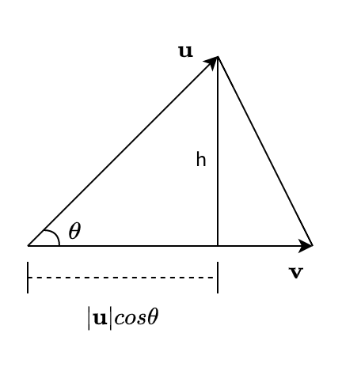

## 两向量的点积（内积）

点积有两种定义方式：代数方式和几何方式。
通过在欧氏空间中引入笛卡尔坐标系，向量之间的点积既可以由向量坐标的代数运算得出，
也可以通过引入两个向量的长度和角度等几何概念来求解。

我们分别给出两种定义：

**代数定义**

设三维空间内有两个向量$\mathbf{u} = (u_1, u_2, u_3)$和$\mathbf{v} = (v_1, v_2, v_3)$ ，
定义它们的数量积（又叫内积、点积）为以下实数：

$$
\mathbf{u} \cdot \mathbf{v} = u_1 v_1 + u_2 v_2 + u_3 v_3
$$

更一般地，n维向量的内积定义如下：

$$
\mathbf{u} \cdot \mathbf{v} = \sum\limits_{i=1}^n u_i v_i = u_1 v_1 + u_2 v_2 + \cdots + u_n v_n
$$

**几何定义**

设三维空间内有两个向量$\mathbf{u} = (u_1, u_2, u_3)$和$\mathbf{v} = (v_1, v_2, v_3)$，
$|\mathbf{u}|$和$|\mathbf{v}|$表示向量$\mathbf{u}$和$\mathbf{v}$的大小，
它们的夹角为$\theta (0 \leq \theta \leq \pi)$，则内积定义为以下实数：

$$
\mathbf{u} \cdot \mathbf{v} = |\mathbf{u}| |\mathbf{v}| \cos(\theta) 
$$

该定义只对二维和三维空间有效。

下面我们给出代数定义与几何定义的等价性推导，我们以下图为例：

我们从两个向量$$\mathbf{u}$$和$|\mathbf{v}|$中构建一个三角形。

从三角原理中，我们知道三角形的高h可表示为

$$
h = |\mathbf{u}| \sin(\theta)
$$

两边平方得到

$$
h^{2} = |\mathbf{u}|^{2} \sin^{2}(\theta)
$$

根据三角恒等式

$$
\sin^{2}(\theta) + \cos^{2}(\theta) = 1
$$

有

$$
h^{2} = |\mathbf{u}|^{2} (1 - \cos^{2}(\theta))     \tag{1}
$$

在图中，相对于其他直角三角形，也可以表示高h，并结合勾股定理：

$$
h^{2} = |\mathbf{u} - \mathbf{v}|^{2} - (|\mathbf{v}| - |\mathbf{u}| \cos(\theta))^{2}      \tag{2}
$$

令式$(1)$和式$(2)$相等并简化，得到表达式

$$
|\mathbf{u}|^{2} (1 - \cos^{2}(\theta)) = |\mathbf{u} - \mathbf{v}|^{2} - (|\mathbf{v}| - |\mathbf{u}| \cos(\theta))^{2}    \\
\Downarrow \\
|\mathbf{u}|^{2} - |\mathbf{u}|^{2} \cos^{2}(\theta) = |\mathbf{u} - \mathbf{v}|^{2} - |\mathbf{v}|^{2} + 2 |\mathbf{u}| |\mathbf{v}| \cos(\theta) - |\mathbf{u}|^{2} \cos^{2}(\theta)  \\
\Downarrow \\
$$

$$
|\mathbf{u} - \mathbf{v}|^{2} = |\mathbf{u}|^{2} + |\mathbf{v}|^{2} - 2 |\mathbf{u}| |\mathbf{v}| \cos(\theta)      \tag{3}
$$

式$(3)$是不是很眼熟，对就是向量形式的余弦定理公式。

可以用公式将$|\mathbf{u} - \mathbf{v}|^{2}$明确写成另一种表达式

$$
\begin{align}
|\mathbf{u} - \mathbf{v}|^{2} & = (\mathbf{u} - \mathbf{v}) \cdot (\mathbf{u} - \mathbf{v}) \\
        & = |\mathbf{u}|^{2} - 2 \mathbf{u} \cdot \mathbf{v} + |\mathbf{v}|^{2}     \tag{4}
\end{align}
$$

通过令式$(3)$和式$(4)$相等，得

$$
\mathbf{u} \cdot \mathbf{v} = |\mathbf{u}| |\mathbf{v}| \cos(\theta)        \tag{5}
$$

式$(5)$就是点积的几何定义。

#### 参考资料:

- 《实用线性代数 图解版》2.7 点积
- [百度百科：点积](https://baike.baidu.com/item/%E7%82%B9%E7%A7%AF/9648528)
