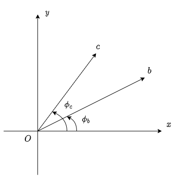

## 计算两个向量的夹角

我们可以通过点积计算两个向量的夹角。

上图给出二维的情况，其中向量$\mathbf{b}$和向量$\mathbf{c}$与$x$轴的夹角分别为$\phi_{b}$和$\phi_{c}$，从基本三角函数可得：
$$
\mathbf{b} = (|\mathbf{b}| \cos \phi_{b}, |\mathbf{b}| \sin \phi_{b}) \\
\mathbf{c} = (|\mathbf{c}| \cos \phi_{c}, |\mathbf{c}| \sin \phi_{c})
$$

我们把上式代入点积公式，得到
$$
\mathbf{b} \cdot \mathbf{c} =
|\mathbf{b}| |\mathbf{c}| \cos \phi_{b} \cos \phi_{c} +
|\mathbf{b}| |\mathbf{c}| \sin \phi_{b} \sin \phi_{c}
$$

再次应用三角函数加法定理，得到
$$
\begin{aligned}
\mathbf{b} \cdot \mathbf{c} & =
|\mathbf{b}| |\mathbf{c}| ( \cos \phi_{b} \cos \phi_{c} + \sin \phi_{b} \sin \phi_{c} ) \\
& = |\mathbf{b}| |\mathbf{c}| \cos ( \phi_{c} - \phi_{b} )
\end{aligned}
$$

最终，对任意两个向量$\mathbf{b}$和$\mathbf{c}$，我们有：
$$
\mathbf{b} \cdot \mathbf{c} =
|\mathbf{b}| |\mathbf{c}| \cos ( \theta )
$$

其中$\theta$是$\mathbf{b}$和$\mathbf{c}$之间的夹角。

为了得到更简洁的形式，在等式两边同除以$|\mathbf{b}| |\mathbf{c}|$并使用单位向量的表示形式$\hat{\mathbf{b}} = \mathbf{b} / |\mathbf{b}|$，我们得到：
$$
\cos ( \theta ) = \hat{\mathbf{b}} \cdot \hat{\mathbf{c}}
$$

总结如下：两个向量$\mathbf{b}$和$\mathbf{c}$之间夹角的余弦等于归一化后的向量的点积。

注：同样的结果也适用于三维、四维乃至任意多维，前提是两个向量具有相同的维度。

#### 参考资料:
《计算机图形学（OpenGL版）（第3版）》4.3.2章节
