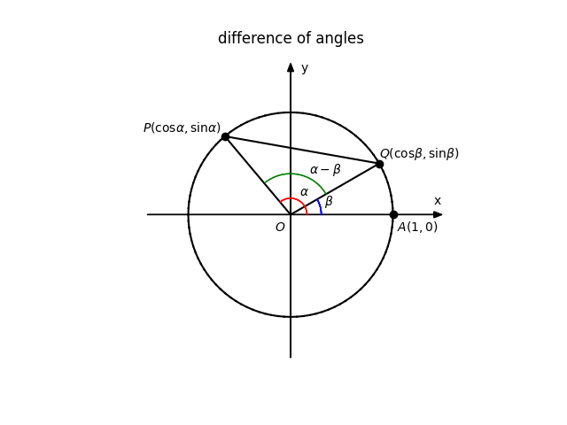

## 三角函数的加法定理及证明

两个角$\alpha$、$\beta$的和或者差的三角函数，可以用$\alpha$、$\beta$角的三角函数的代数式来表示。
$$
\sin(\alpha + \beta) = \sin \alpha \cdot \cos \beta + \cos \alpha \cdot \sin \beta         \qquad\qquad (1)
$$
$$
\sin(\alpha - \beta) = \sin \alpha \cdot \cos \beta - \cos \alpha \cdot \sin \beta         \qquad\qquad (2)
$$
$$
\cos(\alpha + \beta) = \cos \alpha \cdot \cos \beta - \sin \alpha \cdot \sin \beta         \qquad\qquad (3)
$$
$$
\cos(\alpha - \beta) = \cos \alpha \cdot \cos \beta + \sin \alpha \cdot \sin \beta         \qquad\qquad (4)
$$
$$
\tan(\alpha + \beta) = \frac{\tan \alpha + \tan \beta}{1 - \tan \alpha \cdot \tan \beta}   \qquad\qquad (5)
$$
$$
\tan(\alpha - \beta) = \frac{\tan \alpha - \tan \beta}{1 + \tan \alpha \cdot \tan \beta}   \qquad\qquad (6)
$$
这一组公式也叫做三角函数的**加法定理**。还有叫“和差化积公式”或“和角公式（sum of angles formula）”的。

下面给出这组公式的证明，证明按照$(4) \rightarrow (3) \rightarrow (1) \rightarrow (2) \rightarrow (5) \rightarrow (6)$的顺序给出。

证明：

我们首选证明公式(4)，证明思路是通过余弦定理和直角坐标系的两点间距离公式导出。

如下图：

设$P$、$Q$是单位圆上的两点，$\angle AOP = \alpha$，$\angle AOQ = \beta$，$\angle QOP = \alpha - \beta$，
那么有，$P$点的坐标为$(\cos \alpha, \sin \alpha)$，$Q$点的坐标为$(\cos \beta, \sin \beta)$。
根据余弦定理有
$$
|PQ|^{2} = |OP|^{2} + |OQ|^{2} - 2|OP| \cdot |OQ| \cos (\alpha - \beta)     \qquad\qquad (7)
$$
其中$|OP| = |OQ| = 1$，所以(7)式可以化简为
$$
|PQ|^{2} = 2 - 2 \cos (\alpha - \beta)     \qquad\qquad (8)
$$
再根据两点间的距离公式有
$$
|PQ| = \sqrt{(\cos \alpha - \cos \beta)^{2} + (\sin \alpha - \sin \beta)^{2}}     \qquad\qquad (9)
$$
将(9)式两边取完全平方并化简
$$
\begin{aligned}
|PQ|^{2} & = (\cos \alpha - \cos \beta)^{2} + (\sin \alpha - \sin \beta)^{2} \\
         & = \cos ^{2} \alpha - 2 \cos \alpha \cdot \cos \beta + \cos ^{2} \beta
            + \sin ^{2} \alpha - 2 \sin \alpha \cdot \sin \beta + \sin ^{2} \beta \\
         & = 2 - 2 (\cos \alpha \cdot \cos \beta + \sin \alpha \cdot \sin \beta)    \qquad\qquad (10)
\end{aligned}
$$
将(8)式代入(10)式，并化简就有
$$
\cos (\alpha - \beta) = (\cos \alpha \cdot \cos \beta + \sin \alpha \cdot \sin \beta)
$$
公式(4)得证。

通过(4)式，将$\beta$换成$-\beta$，加上诱导公式可得出公式(3)
$$
\begin{aligned}
\cos (\alpha + \beta) & = \cos (\alpha - (-\beta))      \\
                      & = \cos \alpha \cdot \cos (-\beta) + \sin \alpha \cdot \sin (-\beta)     \\
                      & = \cos \alpha \cdot \cos \beta - \sin \alpha \cdot \sin \beta
\end{aligned}
$$

同样的方式可以证明公式(1)
$$
\begin{aligned}
\sin(\alpha + \beta) & = \cos(\frac{\pi}{2} - (\alpha + \beta))      \\
                     & = \cos((\frac{\pi}{2} - \alpha) - \beta)      \\
                     & = \cos(\frac{\pi}{2} - \alpha) \cdot \cos \beta + \sin(\frac{\pi}{2} - \alpha) \cdot \sin \beta \\
                     & = \sin \alpha \cdot \cos \beta + \cos \alpha \cdot \sin \beta
\end{aligned}
$$

然后由公式(1)推出公式(2)
$$
\begin{aligned}
\sin(\alpha - \beta) & = \sin (\alpha - (-\beta))      \\
                     & = \sin \alpha \cdot \cos (-\beta) + \cos \alpha \cdot \sin (-\beta) \\
                     & = \sin \alpha \cdot \cos \beta - \cos \alpha \cdot \sin \beta
\end{aligned}
$$

由公式(1)和公式(3)推出公式(5)
$$
\begin{aligned}
\tan(\alpha + \beta) & = \frac{\sin(\alpha + \beta)}{\cos (\alpha + \beta)}       \\
                     & = \frac{\sin \alpha \cdot \cos \beta + \cos \alpha \cdot \sin \beta}{\cos \alpha \cdot \cos \beta - \sin \alpha \cdot \sin \beta}    \\
                     & = \frac{(\sin \alpha \cdot \cos \beta + \cos \alpha \cdot \sin \beta)/(\cos \alpha \cdot \cos \beta)}{(\cos \alpha \cdot \cos \beta - \sin \alpha \cdot \sin \beta)/(\cos \alpha \cdot \cos \beta)}      \\
                     & = \frac{\tan \alpha + \tan \beta}{1 - \tan \alpha \cdot \tan \beta}
\end{aligned}
$$

同样的方式，由公式(2)和公式(4)推出公式(5)
$$
\begin{aligned}
\tan(\alpha - \beta) & = \frac{\sin(\alpha - \beta)}{\cos (\alpha - \beta)}       \\
                     & = \frac{\sin \alpha \cdot \cos \beta - \cos \alpha \cdot \sin \beta}{\cos \alpha \cdot \cos \beta + \sin \alpha \cdot \sin \beta}    \\
                     & = \frac{(\sin \alpha \cdot \cos \beta - \cos \alpha \cdot \sin \beta)/(\cos \alpha \cdot \cos \beta)}{(\cos \alpha \cdot \cos \beta + \sin \alpha \cdot \sin \beta)/(\cos \alpha \cdot \cos \beta)}      \\
                     & = \frac{\tan \alpha - \tan \beta}{1 + \tan \alpha \cdot \tan \beta}
\end{aligned}
$$

至此，加法定理的6个公式证明完毕。$\blacksquare$
